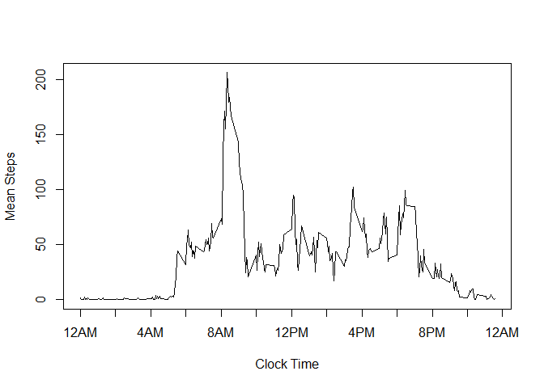

# Reproducible Research: Peer Assessment 1

##Loading and preprocessing the data.

The goal of this project is to read and interpret data from a fitness monitoring device for one individual between October and November of 2012.  
First things first, we need to read the data, contained in a file called "activity.csv". We will store it into a variable called ActData


```r
ActData <- read.csv("activity.csv")
```

Now, we need to transform some of this data so that we can read it properly. We will be translating the dates from character values into Dates, and translating the intervals from a HHMM format to just minutes.


```r
ActData[,2] <- as.Date(ActData[,2], format = "%Y-%m-%d")
ActData[,4] <- ActData[,3] - (as.integer(ActData[,3]/100)*40)
names(ActData)[4] <- "intervalMinutes"
```

At this point, our data looks like the following (Note that we aren't just looking at the header as all the step values are NA at that time):


```r
ActData[1000:1004,]
```

```
##      steps       date interval intervalMinutes
## 1000     0 2012-10-04     1115             675
## 1001     0 2012-10-04     1120             680
## 1002   180 2012-10-04     1125             685
## 1003    21 2012-10-04     1130             690
## 1004     0 2012-10-04     1135             695
```

Where interval is the clock time, while intervalMinutes is that time expressed as minutes since Midnight.

##What is the mean total number of steps taken per day?

To answer this question, we will first need to determine the total number of steps taken for each day. We will loop through each of the 61 days, calculating this total at each step. Note that because we have 1440 minutes per day, we have 288 intervals per day.


```r
DailyStep <- 0
for(i in 1:61){
  DailyStep[i] <- sum(ActData[((i-1)*288+1):((i-1)*288+288),1], na.rm=TRUE)
}
head(DailyStep)
```

```
## [1]     0   126 11352 12116 13294 15420
```

Now, let's look at this in a histogram.


```r
hist(DailyStep, xlab = "Total Steps Per Day",breaks=10,col="red")
```

 

We can see that the average number of steps per day were probaly a little over 10,000. Let's run some code to find out for sure.


```r
mean(DailyStep)
```

```
## [1] 9354.23
```

```r
median(DailyStep)
```

```
## [1] 10395
```

Well, we were close. The mean was 9354.23, just under 10,000 The median was 10395, just over 10,000.

##What is the average daily activity pattern?

Now we want to slice the data the other way and look at the number of steps during each time interval, averaged over the two month time period.


```r
MeanStep <- 0
for (i in 1:288){
  MeanStep[i] <- mean(ActData[(ActData[,4]==((i-1)*5)),1],na.rm=TRUE)
}
```

Now, let's plot this average over the course of the day.


```r
plot(ActData[1:288,3],MeanStep, type="l", xaxt="n",xlab="Clock Time",ylab = "Mean Steps")
axis(1, at = c(0,200,400,600,800,1000,1200,1400,1600,1800,2000,2200,2400),labels=c("12AM","","4AM","","8AM","","12PM","","4PM","","8PM","","12AM"))
```

 

From this we can tell this individual likely sleeps from around 10 PM til a little before 5 AM, and their activity peaks right around 8 AM. Let's analyze the data real quick to see when, exactly, they are at their most active.


```r
max(MeanStep)
```

```
## [1] 206.1698
```

```r
ActData[which.max(MeanStep),3]
```

```
## [1] 835
```

So, the five minute interval starting at 8:35 AM until 8:40 AM has the highest mean number of steps taken at just over 206 steps.

##Imputing missing values.

If we look at the data, we can tell that we have serveral missing values coded as NA in our steps collumn. Let's see just how many of these NA values we have in our data.


```r
NACount <- is.na(ActData[,1])
sum(NACount)
```

```
## [1] 2304
```

It looks like we have 2304 NA values out of the 17568 rows in our data. This could cause significant bias in our data. In attempt to even this out, we will be replacing these NA values with the mean steps for that time interval across all other days. To make sure we preserve the original data, we will store these mean corrected values into a copy of that original data.


```r
ActData2 <- ActData
for(i in 1:61){
  for(j in 1:288){
    if(is.na(ActData2[((i-1)*288+j),1])){
      ActData2[((i-1)*288+j),1] <- MeanStep[j]
    }
  }
}
```

Now that we have filled in all those values, let's look at that histogram again.


```r
DailyStep2 <- 0
for(i in 1:61){
  DailyStep2[i] <- sum(ActData2[((i-1)*288+1):((i-1)*288+288),1], na.rm=TRUE)
}
hist(DailyStep2, xlab = "Total Steps Per Day",breaks=10,col="red")
```

 

Once again, it looks like the mean and median are a little over 10,000. Let's calculate those directly to be sure.


```r
mean(DailyStep2)
```

```
## [1] 10766.19
```

```r
median(DailyStep2)
```

```
## [1] 10766.19
```

So, as a whole replacing these missing values with the mean number of steps for each interval has removed the early peak from our histogram and intensified the peak just above 10,000 steps. This is largely due to the fact that every day that was previously all NA values now has a total daily step count of 10766.19, which is also our new median and mean. Both values are higher now than they were without the replacement of the NA values due to the removal of several days that had artificially low total counts due to the NA values.

##Are there differences in activity patterns between weekdays and weekends?

Now we want to examine the data to see if there is a significant difference between step activity during weekdays vs weekends. To look at this, we first need to generate a new collumn to denote if a day is a weekday or weekend.


```r
ActData2[,5] <- weekdays(ActData2[,2],abbreviate=TRUE)
for(i in 1:61){
  if(ActData2[((i-1)*288+1),5]=="Sat"|ActData2[((i-1)*288+1),5]=="Sun"){
   ActData2[((i-1)*288+1):((i-1)*288+288),5] <- 0
  }else {
    ActData2[((i-1)*288+1):((i-1)*288+288),5] <- 1
  }
}
ActData2[,5] <- factor(ActData2[,5], labels = c("Weekend","Weekday"))
names(ActData2)[5] <- "DayType"
```

Now that that's done, we need to find new values for the mean steps taken in each interval during the week and the weekend, as well as set up the data we will ultimately use to plot the differences.


```r
SplitData2 <- split(ActData2, ActData2$DayType)
MeanStep2 <- data.frame(0,0,0)
for (i in 1:288){
  MeanStep2[i,1] <- mean(SplitData2$Weekend[(SplitData2$Weekend[,4]==((i-1)*5)),1])
  MeanStep2[i,2] <- "Weekend"
  MeanStep2[(i+288),1] <- mean(SplitData2$Weekday[(SplitData2$Weekday[,4]==((i-1)*5)),1])
  MeanStep2[(i+288),2] <- "Weekday"
}
MeanStep2[,3] <- ActData2[1:576,3]
names(MeanStep2) <- c("MeanSteps","DayTyper","Time")
```

Let's plot the two next to each other and see if there are significant differences between the step pattern on the weekend and the rest of the week.


```r
library(lattice)
xyplot(MeanSteps ~ Time|DayTyper,data=MeanStep2 ,type="l",layout=c(1,2), ylab = "Number of Steps (Mean)")
```

 

We can see several immediate differences. The individual seems to be more active overall during the weekend, but at more random times. The active period of the day also starts later on the weekends, as opposed to the weekdays where it is consistently a little after 5 AM. We also note that the major peak of activity during the week around 8:30 AM is still fairly active during the weekend, but is nowhere near as dominant compared to the rest of the day's activities.
